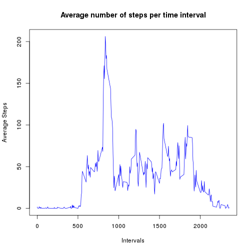
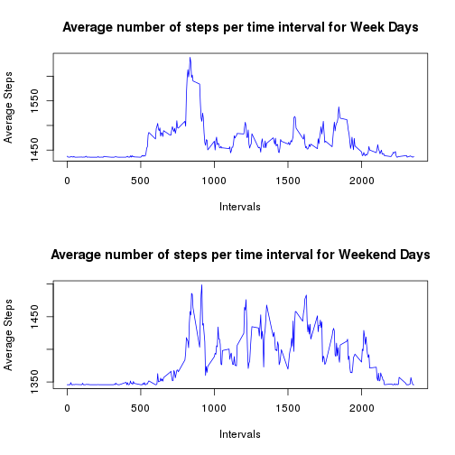

## Loading and preprocessing the data

### Load Data
Using read.csv() to load the file's data to a dataframe.

```r
rawData <-  read.csv("activity.csv")
```
### Process/transform the data (if necessary) into a format suitable for your analysis
Here the records having NA values are omitted and the remaining records are assigned to a new dataframe. After that for convenience each column of the new dataframe is assigned to a distinct variable.

```r
noNa <- na.omit(rawData)

steps <- noNa$steps
intervals <- noNa$interval
dates <-  noNa$date
```

## What is mean total number of steps taken per day?
### Make a histogram of the total number of steps taken each day
Here we exploit the *aggregate()* function for evaluating the total number of steps per day. Then the *hist()* function is used creating the histogram of the total number of steps per day.  

```r
totalSteps <- setNames(aggregate(steps, by=list(dates), sum), c('Dates', 'Total Steps'));
hist(totalSteps$'Total Steps', main = 'Histogram of Total steps per Day', xlab = 'Total Steps per Day')
```

 
### Calculate and report the mean and median total number of steps taken per day
Here the mean and median of the total number of steps taken per day is evaluated.

```r
mean(totalSteps$'Total Steps')
```

```
## [1] 10766.19
```

```r
median(totalSteps$'Total Steps')
```

```
## [1] 10765
```

## What is the average daily activity pattern?

### Make a time series plot (i.e. type = "l") of the 5-minute interval (x-axis) and the average number of steps taken, averaged across all days (y-axis)
Again the *aggregate()* function comes to our help for evaluating the average number of steps per interval across all days. The *plot()* function is used to create the time series plot. 

```r
avgSteps <- setNames(aggregate(steps, by = list(intervals), mean), c('Intervals', 'Average Steps'))
plot(avgSteps$Intervals, avgSteps$'Average Steps', type = 'l', col = 'blue', main= 'Average number of steps per time interval', ylab = 'Average Steps', xlab = 'Intervals')
```

 
### Which 5-minute interval, on average across all the days in the dataset, contains the maximum number of steps?
The function *which()* is used to find the interval having the maximum number steps (averaged across all days). 

```r
avgSteps[which(avgSteps$'Average Steps' == max(avgSteps$'Average Steps')),1]
```

```
## [1] 835
```

## Imputing missing values

### Calculate and report the total number of missing values in the dataset (i.e. the total number of rows with NAs)
Here we exploit *complete.cases()* for locating the records containing NA values and *nrow()* for counting these records.

```r
nrow(rawData[!complete.cases(rawData),])
```

```
## [1] 2304
```

### Devise a strategy for filling in all of the missing values in the dataset. The strategy does not need to be sophisticated. For example, you could use the mean/median for that day, or the mean for that 5-minute interval, etc.
Well our strategy consists in filling replacing the NAs with the mean value of the total steps taken per day. Towards this we will locate all NA records and assign to the corresponding **"step"** fields the mean value of the total steps taken per day. The next section holds the code that realises this strategy

### Create a new dataset that is equal to the original dataset but with the missing data filled in.
Here we copy our initial data (NAs included) to a new dataframe and then we assign to all **"step"** fields having a NA value the mean value of the total steps taken per day.  
```{R}
newData <- rawData
newData$steps[!complete.cases(rawData)]=mean(totalSteps$'Total Steps')
```
### Make a histogram of the total number of steps taken each day and Calculate and report the mean and median total number of steps taken per day. Do these values differ from the estimates from the first part of the assignment? What is the impact of imputing missing data on the estimates of the total daily number of steps?

Here we exploit the *aggregate()* function for evaluating the total number of steps per day. Then the *hist()* function is used creating the histogram of the total number of steps per day.  

```r
totalStepsImput <- setNames(aggregate(newData$steps, by=list(newData$date), sum), c('Dates', 'Total Steps'));
hist(totalStepsImput$'Total Steps', main = 'Histogram of Total steps per Day', xlab = 'Total Steps per Day')
```

 
It looks like that the used imputing strategy resulted in the formation of two clusters. The first and most dominant contains all the records with less than 500000 steps whereas the second has all the records with total numbers of steps 3000000 and more.

## Are there differences in activity patterns between weekdays and weekends?


### Create a new factor variable in the dataset with two levels – “weekday” and “weekend” indicating whether a given date is a weekday or weekend day.
First we fill in values for week days, second for weekend days and last we convert the new column's type  to factor. 

```r
newData$dayStatus[!weekdays(as.Date(newData$date)) %in% c('Saturday', 'Sunday')] <- 'weekDay'
newData$dayStatus[weekdays(as.Date(newData$date)) %in% c('Saturday', 'Sunday')] <- 'weekendDay'
newData$dayStatus <-  as.factor(newData$dayStatus)
```
### Make a panel plot containing a time series plot (i.e. type = "l") of the 5-minute interval (x-axis) and the average number of steps taken, averaged across all weekday days or weekend days (y-axis). See the README file in the GitHub repository to see an example of what this plot should look like using simulated data.

Again the *aggregate()* function, first for week days and then for the weekend days, comes to our help for evaluating the average number of steps per interval across all days. The *par()* function is used to set the panel for the two plots whereas the  *plot()* function is used to create the time series plots. 

```r
avgStepsWD <- setNames(aggregate(newData$steps[newData$dayStatus=='weekDay'], by = list(newData$interval[newData$dayStatus=='weekDay']), mean), c('Intervals', 'Average Steps'))
avgStepsWND <- setNames(aggregate(newData$steps[newData$dayStatus=='weekendDay'], by = list(newData$interval[newData$dayStatus=='weekendDay']), mean), c('Intervals', 'Average Steps'))

par(mfrow=c(2,1))
plot(avgStepsWD$Intervals, avgStepsWD$'Average Steps', type = 'l', col = 'blue', main= 'Average number of steps per time interval for Week Days', ylab = 'Average Steps', xlab = 'Intervals')
plot(avgStepsWND$Intervals, avgStepsWND$'Average Steps', type = 'l', col = 'blue', main= 'Average number of steps per time interval for Weekend Days', ylab = 'Average Steps', xlab = 'Intervals')
```

 
